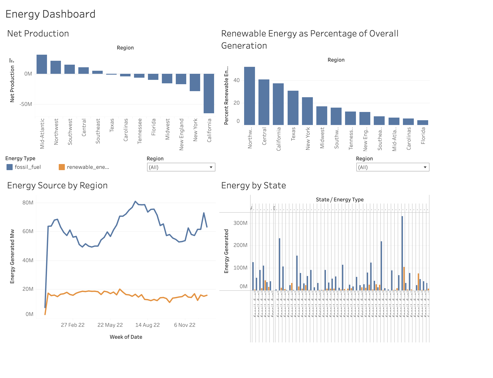

# Intel Data Center Location Analysis

A SQL and Tableau project analyzing US regional energy data to help Intel decide where to build their next data center.

---

## Background

Intel is planning to build a new data center and wanted to understand which US regions would be the best fit based on energy availability and sustainability. I worked with 3 datasets covering regional energy production, power plant locations, and plant-level energy output to answer this question.

---

## Tools Used

| Tool | Purpose |
|------|---------|
| SQL (PostgreSQL) | Querying and analyzing energy data |
| Tableau | Building visualizations and dashboard |
| GitHub | Project documentation |

---

## Datasets

### intel.energy_data
Daily energy production and consumption for different regions in the United States.

| Column | Description |
|--------|-------------|
| balancing_authority | Company responsible for maintaining electricity balance within its region |
| date | The date the energy was produced |
| region | The electric service area within a geographic area of the USA |
| time_at_end_of_hour | The time and date after energy was generated |
| demand | Energy demand in megawatts (MW) on the grid |
| net_generation | Total energy produced in MW by all sources |
| all_petroleum_products | Energy produced in MW by petroleum |
| coal | Energy produced in MW by coal |
| hydropower_and_pumped_storage | Energy produced in MW by water power |
| natural_gas | Energy produced in MW by natural gas |
| nuclear | Energy produced in MW by nuclear fuel |
| solar | Energy produced in MW by solar panels |
| wind | Energy produced in MW by wind turbines |

### intel.power_plants
General information about power plants across the United States.

| Column | Description |
|--------|-------------|
| plant_name | Name of the power plant |
| plant_code | Unique identifier of the plant |
| region | Region in the US where the plant is located |
| state | State where the power plant is located |
| primary_technology | Primary technology used to generate electricity |

### intel.energy_by_plant
Total energy production per plant for the year 2022.

| Column | Description |
|--------|-------------|
| plant_name | Name of the power plant |
| plant_code | Unique identifier of the plant |
| energy_type | Type of energy generated — renewable energy or fossil fuel |
| energy_generated_mw | Total energy generated in MW for 2022 |

---

## Project Structure

```
intel-data-center-sql-analysis/
│
├── README.md
├── images/
│   └── Dashboard.png
└── sql/
    ├── task1_energy_generation.sql
    ├── task2_energy_by_type.sql
    ├── task3_power_plant_analysis.sql
    └── task4_hourly_energy_trends.sql
```

---

## What I Did

**Task 1 — Energy Generation**

I started by calculating which regions produce more energy than they consume. I also looked at total renewable energy and what percentage of each region's energy mix comes from renewable sources.

What I found: The Mid-Atlantic has the highest energy surplus at 31,693,087 MW. But when I looked at renewable percentage, Northwest came out on top. Texas looks strong in total renewables but burns a lot of fossil fuels too, which pulls its percentage down. California actually jumped from 5th in total renewables to 2nd in percentage, showing its grid is much greener relative to its total energy mix.

---

**Task 2 — Building an Energy Type Dataset**

I built a new dataset that separates renewable energy from fossil fuel energy by date and region, then combined them using UNION ALL. This dataset was used to power the Tableau trend charts.

What I found: Fossil fuels still dominate most regions but renewable energy has been growing steadily through 2022, especially in the Northwest.

---

**Task 3 — Power Plant Analysis**

I joined two tables to analyze power plants at a deeper level, looking at how many renewable plants each region has and how efficient their solar plants are.

What I found: The Midwest has 71 solar plants but generates much less energy than California or Texas. Florida with only 8 more plants than the Midwest produces more than double the energy. This points to smaller, older, or less efficient installations in the Midwest, likely due to less sunlight compared to southern states.

---

**Task 4 — Hourly Energy Trends**

I looked at how renewable energy generation changes throughout the day by extracting the hour from timestamps using date_part, then compared California vs Northwest side by side.

What I found: California's renewable energy drops significantly at night because it relies heavily on solar. The Northwest stays consistent throughout the day thanks to hydropower, which makes it a much better fit for a data center that runs 24/7.

---

## Dashboard



---

## My Recommendation

Based on everything I analyzed, I would recommend the **Northwest region — specifically Washington or Oregon** for Intel's new data center.

The Northwest has a strong energy surplus, the highest renewable energy percentage of any region, and its hydropower keeps generation stable at all hours of the day. For a data center that never shuts off, that round-the-clock reliability is what matters most.

The Mid-Atlantic was close in terms of surplus energy but falls behind on sustainability. California is strong on renewables but too dependent on solar, which creates gaps at night.

---

## SQL Concepts Used

- SUM, COUNT, ROUND
- GROUP BY, ORDER BY, HAVING
- JOIN
- WITH (CTEs)
- UNION ALL
- date_part for time-based analysis
